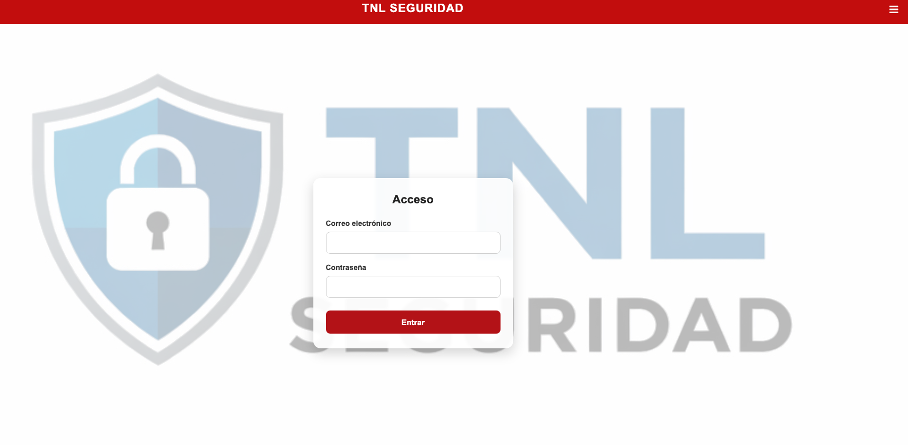
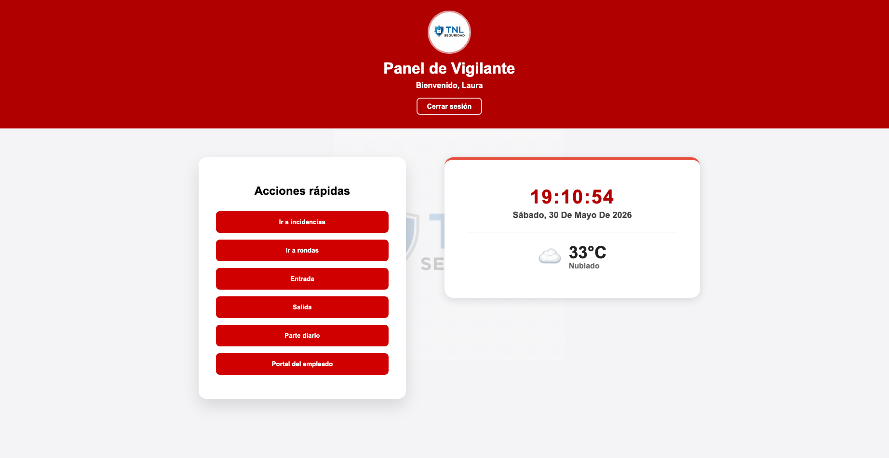
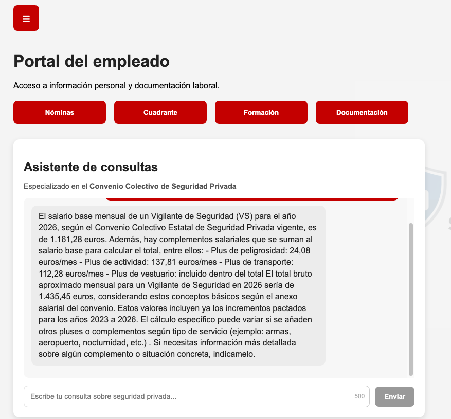
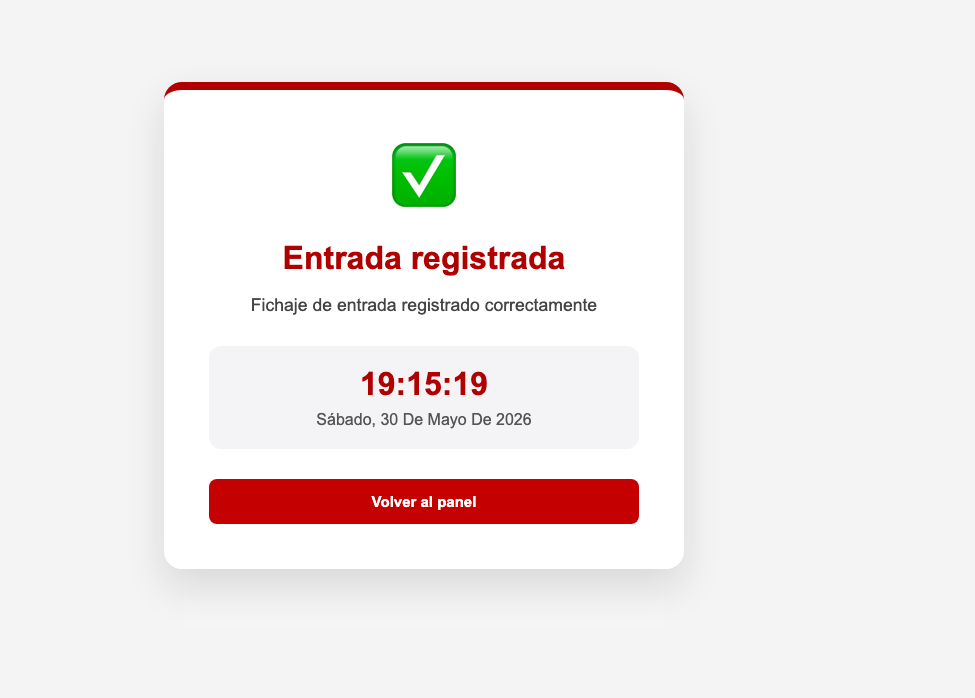
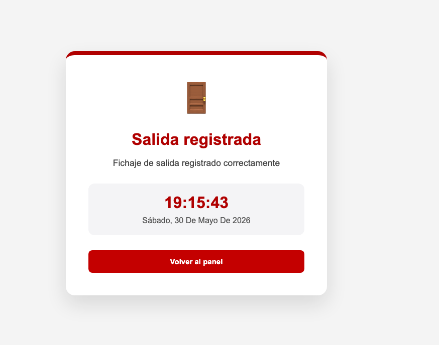

# TNL Seguridad - Plataforma Full Stack con IA

Proyecto desarrollado como Trabajo Fin de Grado de Desarrollo de Aplicaciones Web (DAW).

## Índice

* [Descripción](#descripción)
* [Tecnologías utilizadas](#tecnologías-utilizadas)
* [Funcionalidades](#funcionalidades)
* [Capturas de pantalla](#capturas-de-pantalla)
* [Arquitectura](#arquitectura)
* [Instalación](#instalación)
* [Estado del proyecto](#estado-del-proyecto)
* [Autor](#autor)

## Descripción

Plataforma web para la gestión operativa de vigilantes de seguridad que permite el control de fichajes, gestión de partes diarios y acceso a un portal del empleado con un asistente inteligente basado en IA.

## Tecnologías utilizadas

### Frontend

* React
* TypeScript
* Vite
* React Router
* CSS

### Backend

* Node.js
* Express
* PostgreSQL

### Inteligencia Artificial

* OpenAI API
* Asistente especializado en consultas sobre el Convenio Colectivo de Seguridad Privada

## Funcionalidades

### Autenticación

* Inicio de sesión de usuarios
* Gestión de sesiones

### Dashboard

* Panel principal para vigilantes
* Accesos rápidos

### Control horario

* Registro de entrada
* Registro de salida

### Parte diario

* Registro diario del servicio
* Calendario operativo

### Portal del empleado

* Acceso a información laboral
* Consulta de documentación
* Asistente IA especializado en Seguridad Privada

## Capturas de pantalla

### Login



### Dashboard principal



### Portal del empleado con IA



### Registro de entrada



### Registro de salida



## Arquitectura

```txt
Frontend (React + TypeScript)
        │
        ▼
Backend (Node.js + Express)
        │
        ▼
PostgreSQL
```

## Instalación

### Frontend

```bash
npm install
npm run dev
```

### Backend

```bash
cd backend
npm install
npm run dev
```

## Estado del proyecto

✅ Proyecto funcional

✅ Autenticación de usuarios

✅ Dashboard operativo para vigilantes

✅ Registro de entradas y salidas

✅ Portal del empleado

✅ Asistente IA especializado en Seguridad Privada

✅ Backend conectado a PostgreSQL

✅ Proyecto desarrollado como Trabajo Fin de Grado (DAW)

## Autor

Antonio González

Desarrollador Full Stack especializado en Desarrollo de Aplicaciones Web (DAW), con experiencia en React, TypeScript, Node.js, PostgreSQL e integración de Inteligencia Artificial.
